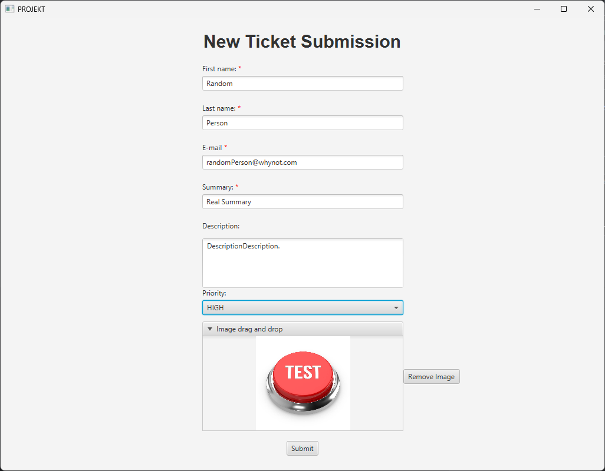
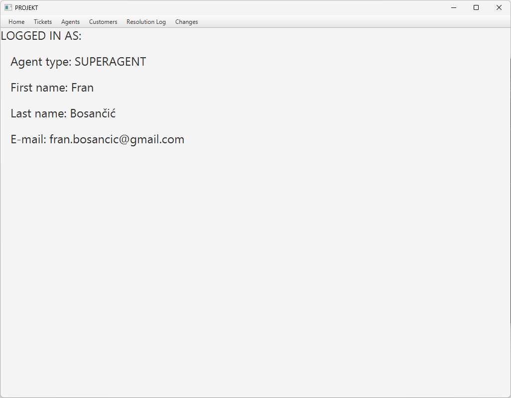
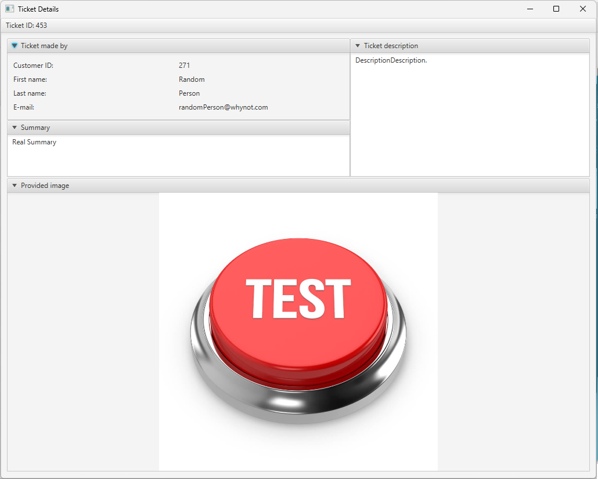
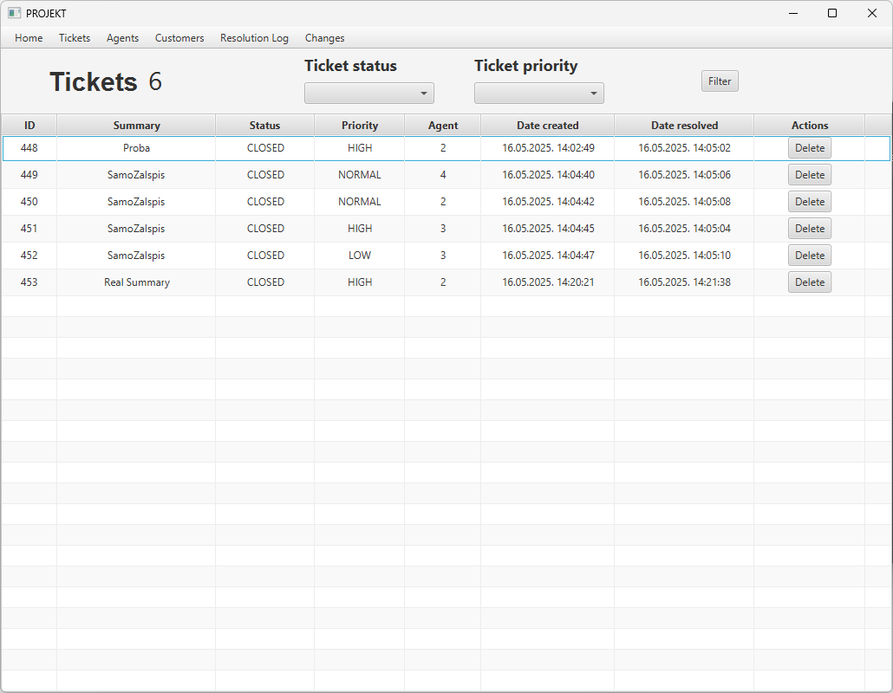
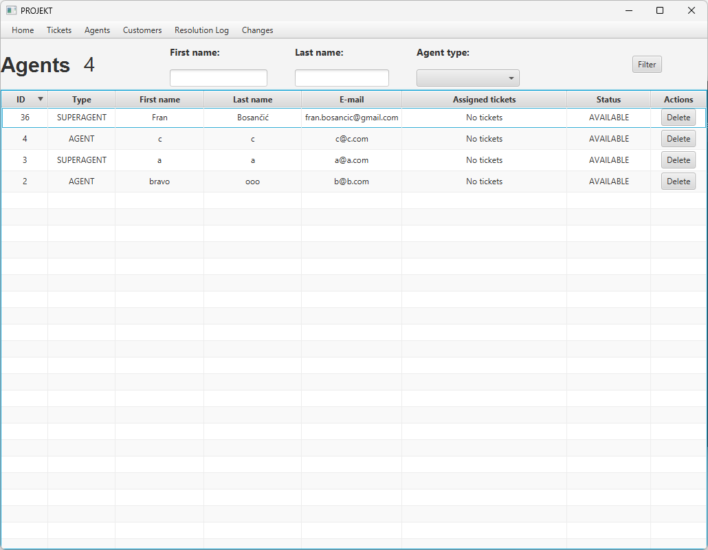

# 📞 Sustav za Upravljanje Korisničkom Podrškom (Customer Support Ticketing System)

Java aplikacija za praćenje korisničkih zahtjeva i tiketa kroz poslovni radni tok.

---

## 📝 Opis

Ovaj sustav omogućuje upravljanje korisničkim upitima, dodjelu prioriteta te automatsko raspoređivanje tiketa agentima podrške. Namijenjen je organizacijama koje žele bolju kontrolu nad korisničkom podrškom.

---

## 🔧 Funkcionalnosti

- ✅ Slanje i upravljanje korisničkim tiketima
- 📊 Praćenje statusa tiketa (otvoren, u radu, riješen)
- 🚨 Postavljanje razina prioriteta
- 👥 Upravljanje timom podrške
- ⚙️ Automatska dodjela tiketa agentima putem niti (threads)
- 🧾 Baza korisničkih profila i zapisa rješenja

---
## 🖼️ Screenshotovi (Neke od funkcionalnosti aplikacije)

### Stvaranje ticketa


### Agent home screen


### Ticket details


### All tickets


### All agents


---

## 🗄️ Baza podataka

Aplikacija koristi **H2 bazu podataka**, koju je potrebno pokrenuti prije pokretanja same aplikacije.

**Podaci za pristup bazi:**

- **Naziv baze:** `proba`
- **Lokacija:** `baza_stvari/`
- **Postavke za spajanje (nalaze se u `database.properties`):**

```properties
databaseUrl=jdbc:h2:tcp://localhost/~/proba
username=fran
password=fran
```


# ✅ Zadovoljene funkcionalnosti

Ovaj projekt zadovoljava sve **minimalne funkcionalnosti** propisane u uputama za projektni zadatak iz kolegija *Programiranje u Javi* (TVZ 2024/2025).

---

## 1. Struktura paketa

- Klase su organizirane prema svojoj ulozi:
  - Entiteti u posebnom paketu
  - Glavna klasa u zasebnom paketu
  - Iznimke, generičke klase i druge pomoćne klase također u zasebnim paketima

---

## 2. Objektno orijentirane značajke

- Korištenje:
  - ✅ Apstraktnih klasa
  - ✅ Sučelja i zapečaćenih sučelja (`sealed`)
  - ✅ Zapisa (`record`)
  - ✅ Builder pattern oblikovnog obrasca

---

## 3. Rukovanje iznimkama

- Korištenje `try-catch` blokova na osjetljivim mjestima
- Implementirane vlastite iznimke:
  - označene (`checked`)
  - neoznačene (`unchecked`)
- Sve iznimke se logiraju pomoću **Logback** biblioteke
- Klase iznimki su u posebnom paketu

---

## 4. Kolekcije i lambda izrazi

- Korištenje:
  - `List`, `Set`, `Map` kolekcija
  - Lambda izraza za:
    - filtriranje entiteta
    - sortiranje entiteta

---

## 5. Generičke klase
- Smještene u paket s entitetima

---

## 6. Rad s datotekama

- Tekstualna datoteka za korisnička imena i hashirane lozinke
- Serijalizacija/deserijalizacija promjena pomoću binarnih datoteka

---

## 7. JavaFX ekran za prijavu

- GUI za prijavu korisnika
- Hashirane lozinke iz tekstualne datoteke
- Minimalno dvije korisničke uloge (npr. agent i administrator)

---

## 8. JavaFX ekran za upravljanje entitetima

- Funkcionalnosti:
  - Dodavanje
  - Promjena
  - Brisanje (s potvrdom korisnika)
  - Pretraga i filtriranje u `TableView`

---

## 9. JavaFX ekran za prikaz promjena

- Prikaz serijaliziranih promjena s detaljima:
  - Polje koje je promijenjeno
  - Stara i nova vrijednost
  - Korisnička uloga
  - Datum i vrijeme promjene

---

## 10. Rad s bazom podataka (H2)

- Klasa za rad s bazom uključuje:
  - Kreiranje konekcije
  - Izvršavanje upita
  - Dohvaćanje podataka
  - Zatvaranje konekcije
- Baza sadrži sve entitete aplikacije

---

## 11. Višedretvenost i sinkronizacija

- Korištenje niti za:
  - Osvježavanje podataka na GUI ekranu
  - Sinkronizirani pristup dijeljenim resursima (serijalizirane datoteke)

---

## 12. Veličina klasa i analiza

- ✅ Nijedna klasa ne prelazi 200 linija koda (bez komentara/importa)
- ✅ Analiza provedena pomoću SonarQube alata – nema prijavljenih problema

---

## 13. Dokumentacija

- Svaka klasa i metoda ima Javadoc komentare
